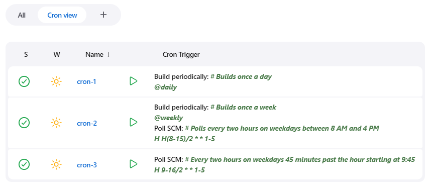

# Cron Column plugin

Show the cron trigger expressions configured for a job in an optional column.
The column displays the cron-like expression of each trigger configured for a job.

## Plugin tutorial

## How to Use

Install the plugin, add a new view, and add the cron column to that view.
